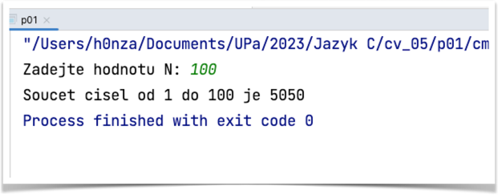

# Příklad 1
## vlastní funkce

Napište vlastní funkci, která přijímá jako parametr celé číslo **N** určující konec posloupnosti. 

Funkce vrací součet celých čísel v posloupnosti **1** až **N**.

Hlavní program vyzve uživatele k zadání hodnoty pro konec posloupnosti, zavolá funkci a vypíše výsledek.

